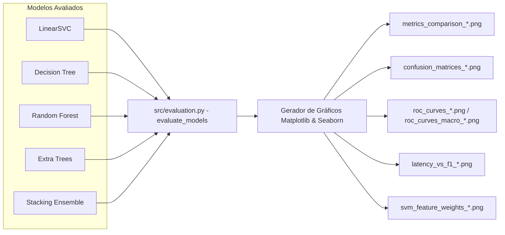
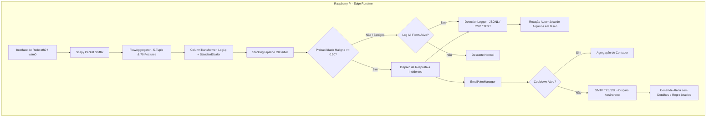

# Arquitetura do Sistema: Detecção de Tráfego Maligno e Benigno (AIDS - Stacking Ensemble)

## 1. Visão Geral

Este projeto consiste em um Sistema de Detecção de Intrusão Baseado em Anomalias e Assinaturas (**AIDS - Anomaly-based Intrusion Detection System**), cujo objetivo principal é classificar pacotes e fluxos de tráfego de rede entre **Maligno** (ataques como DoS/DDoS, Port Scan, Botnet, Brute Force, etc.) e **Benigno** (tráfego legítimo de rede).

O projeto suporta tanto a **Classificação Binária** (Maligno vs. Benigno) quanto a **Classificação Multiclasse** (identificação dos tipos específicos de ataque).

Para obter alta precisão, excelente poder de generalização e estabilidade em datasets de grande escala (ex: `data/CICFlowMeter_out.csv`), a solução emprega um algoritmo de **Stacking Ensemble (Aprendizado em Camadas)** combinando as capacidades complementares do **LinearSVC Calibrado** (separabilidade linear de alta velocidade com calibração isotônica), **Random Forest** (redução de variância por bagging), **Extra Trees** (fronteiras suaves por aleatorização extrema) e **Decision Tree** (regras ortogonais baseadas em entropia e poda ccp), utilizando a **Regressão Logística** como meta-classificador de Nível 1.

---

## 2. Requisitos de Ambiente de Execução e Configuração

### 2.1. Ambiente Virtual Obrigatório (Python venv)

É **estritamente obrigatório** o uso de um ambiente virtual Python isolado (`.venv`) para execução de qualquer comando de instalação, treinamento e avaliação no projeto.

- **Criação do Ambiente Virtual:**

  ```bash
  python -m venv .venv
  ```

- **Ativação:**
  - **Windows (PowerShell):** `.\.venv\Scripts\activate`
  - **Linux / macOS:** `source .venv/bin/activate`

### 2.2. Configuração Dinâmica via Arquivo `.env`

O comportamento do pipeline de treinamento e avaliação é controlado dinamicamente via variáveis de ambiente carregadas do arquivo `.env`:

- `TRAIN_LINEARSVC` (bool, default `True`): Habilita o treinamento do modelo LinearSVC isolado.
- `TRAIN_DT` (bool, default `True`): Habilita o treinamento do modelo Decision Tree isolado.
- `TRAIN_RF` (bool, default `True`): Habilita o treinamento do modelo Random Forest isolado.
- `TRAIN_ET` (bool, default `False`): Habilita o treinamento do modelo Extra Trees isolado.
- `TRAIN_HGB` (bool, default `False`): Habilita o treinamento do modelo HistGradientBoosting isolado.
- `TRAIN_MLP` (bool, default `True`): Habilita o treinamento da Mini Rede Neural (MLPClassifier) isolada.
- `TRAIN_STACKING` (bool, default `True`): Habilita o treinamento do Stacking Ensemble.
- `RUN_BINARY` (bool, default `True`): Executa o pipeline no modo de classificação binária.
- `RUN_MULTICLASS` (bool, default `False`): Executa o pipeline no modo de classificação multiclasse.
- `SAMPLE_FRAC` (float, default `0.1`): Fração de amostragem estratificada do dataset (ex: `0.01` para 1%, `0.1` para 10%).
- `STACKING_N_JOBS` (int, default `2`): Quantidade de processos simultâneos para validação cruzada do Stacking (padrão seguro 2 para evitar estouro de memória RAM e OOM killer no Linux).

---

## 3. Arquitetura da Solução de Machine Learning

### 3.1. O Conceito de Stacking Ensemble

O Stacking combina múltiplos modelos de classificação (Base Learners - Nível 0) através de um meta-classificador (Meta Learner - Nível 1).

- **Nível 0 (Base Learners / Modelos Suportados no Stacking):**
  - **LinearSVC Calibrado (`CalibratedClassifierCV(LinearSVC(...), cv=3)`):** Modelo linear de alta velocidade com parâmetros `C=1.0`, `loss="squared_hinge"`, `dual="auto"`, `tol=1e-3`, `max_iter=5000` e `class_weight='balanced'`, empacotado para calibração de probabilidades de classe via validação cruzada tripla.
  - **HistGradientBoosting Classifier (`HistGradientBoostingClassifier`):** Ensemble de árvores com gradient boosting e binning de histograma configurado com `max_iter=100`, `max_depth=12`, `min_samples_leaf=20`, `learning_rate=0.1`, `class_weight='balanced'` e `random_state=42`. Foca iterativamente nos resíduos de predição, complementando o bagging de forma ortogonal.
  - **Random Forest Classifier (`RandomForestClassifier`):** Ensemble por bagging configurado com `n_estimators=100`, `max_depth=15`, `min_samples_split=4`, `min_samples_leaf=2`, `max_features='sqrt'`, `class_weight='balanced'`, `n_jobs=1` e `random_state=42`.
  - **Extra Trees Classifier (`ExtraTreesClassifier`):** Ensemble de árvores extremamente aleatórias configurado com `n_estimators=100`, `max_depth=15`, `min_samples_split=4`, `min_samples_leaf=2`, `max_features='sqrt'`, `class_weight='balanced'`, `n_jobs=1` e `random_state=42`.
  - **Decision Tree Classifier (`DecisionTreeClassifier`):** Árvore de decisão individual configurada com `criterion='entropy'`, `max_depth=15`, `min_samples_split=5`, `min_samples_leaf=2`, poda `ccp_alpha=0.0001`, `class_weight='balanced'` e `random_state=42` (suportada no perfil legacy).
  - **Mini Rede Neural (`MLPClassifier`):** Perceptron Multicamadas compacto de 2 camadas ocultas `(64, 32)`, ativação ReLU, otimizador Adam, regularização L2 (`alpha=0.0001`), `learning_rate='adaptive'`, `early_stopping=True` para convergência rápida e benchmark não-linear direto (suportada no perfil performance).

- **Perfis de Stacking Suportados (`STACKING_PROFILE`):**
  - `edge` (Padrão otimizado para Raspberry Pi): Combina `linearsvcCalibrated`, `hgb` e `rf`. Baixíssima latência de inferência em borda sem perda de acurácia.
  - `balanced`: Combina `linearsvcCalibrated`, `rf`, `et` e `hgb`.
  - `performance`: Combina `linearsvcCalibrated`, `rf`, `et`, `hgb` e `mlp`.
  - `legacy`: Combina `linearsvcCalibrated`, `rf`, `et` e `dt`.

- **Nível 1 (Meta-Learner):**
  - **Regressão Logística (`LogisticRegression`):** Configurada com `C=1.0`, `class_weight='balanced'`, `solver='lbfgs'`, `max_iter=2000` e `random_state=42`. Opera sobre probabilidades preditas na faixa `[0, 1]` geradas pelos estimadores de Nível 0.
- **Estratégia de Validação do Stacking:**
  - `StratifiedKFold(n_splits=5, shuffle=True, random_state=42)` (configurável via `STACKING_CV_SPLITS`) com `stack_method='auto'`, `passthrough=False` e `n_jobs` controlado dinamicamente via `STACKING_N_JOBS` (padrão `2`).

```mermaid
flowchart TD
    A[Dados de Tráfego de Rede - CICFlowMeter_out.csv] --> B[Remoção de Inf/NaN & Duplicados]
    B --> C[Amostragem Estratificada por SAMPLE_FRAC & Filtro de Classes Raras <5]
    C --> D[Remoção de Colunas Identificadoras & Constantes & Conversão float32]
    D --> E[ColumnTransformer: Imputer + VarianceThreshold + Scaler / OneHotEncoder]

    subgraph Nível 0 - Base Learners (Perfil Edge)
        E --> F[LinearSVC Calibrado - CalibratedClassifierCV cv=3]
        E --> G[HistGradientBoosting - Boosting por Histograma]
        E --> H[Random Forest Classifier - Bagging 100 estimadores]
    end

    F --> J[Probabilidades Calibradas LinearSVC]
    G --> K[Probabilidades HistGradientBoosting]
    H --> L[Probabilidades Random Forest]

    subgraph Nível 1 - Meta Learner
        J --> N["Meta-Classificador - Regressão Logística (class_weight='balanced')"]
        K --> N
        L --> N
    end

    N --> O{Classificação Final}
    O -->|Binary Mode| P[Benigno: 0 vs Maligno: 1]
    O -->|Multiclass Mode| Q[Classes Específicas de Ataque]

    N --> R[Salvamento via Joblib] --> S[Diretório ./models/]
```

---

## 4. Pipeline de Dados, Treinamento e Persistência

### 4.1. Estágios do Pipeline

1. **Ingestão e Amostragem de Dados de Rede (`src/data_loader.py`):**
   - Carregamento do dataset `data/CICFlowMeter_out.csv`.
   - Limpeza de espaços em branco nos nomes de colunas via `str.strip()`.
   - Substituição de valores infinitos (`inf`, `-inf`) por `NaN`, eliminação de registros com valores nulos (`dropna`) e remoção de registros duplicados (`drop_duplicates`).
   - Aplicação de amostragem estratificada controlada pela variável `SAMPLE_FRAC` do `.env` (com fallback automático para amostragem aleatória em caso de falha).
   - Filtragem de classes com menos de 5 amostras para assegurar a integridade e estabilidade da validação cruzada (`StratifiedKFold`).
   - Binarização do alvo no modo binário (`BENIGN` -> 0, qualquer outro -> 1) ou normalização de string no modo multiclasse.

2. **Limpeza e Seleção de Atributos (`src/preprocessing.py`):**
   - Remoção de colunas identificadoras de fluxo: `Flow ID`, `Src IP`, `Dst IP`, `Timestamp`.
   - Remoção de colunas com variância zero / constantes: `Bwd PSH Flags`, `Fwd URG Flags`, `Bwd URG Flags`, `URG Flag Count`, `CWR Flag Count`, `ECE Flag Count`, `Fwd Bytes/Bulk Avg`, `Fwd Packet/Bulk Avg`, `Fwd Bulk Rate Avg`.
   - Conversão e casting de atributos numéricos para `np.float32` e categóricos (`Protocol`) para `str`.

3. **Escalonamento e Pré-processamento (`ColumnTransformer`):**
   - **Pipeline Numérico:** `SimpleImputer(strategy='median')` $\rightarrow$ `VarianceThreshold(threshold=0.0)` $\rightarrow$ `RobustScaler()` (ou `StandardScaler()`).
   - **Pipeline Categórico (`Protocol`):** `SimpleImputer(strategy='constant', fill_value='missing')` $\rightarrow$ `OneHotEncoder(handle_unknown='ignore', dtype=np.float32)`.

4. **Tratamento de Desbalanceamento:**
   - Uso de `class_weight='balanced'` nos estimadores base (`LinearSVC`, `RandomForest`, `ExtraTrees`, `DecisionTree`).

5. **Validação Cruzada & Out-of-Fold Predictions:**
   - Utilização de `StratifiedKFold(n_splits=3, shuffle=True, random_state=42)` no `StackingClassifier` para geração de meta-features sem vazamento de dados (*data leakage*), com paralelização em múltiplos núcleos (`n_jobs=-1`).

6. **Persistência Estruturada de Modelos Treinados (`joblib` na pasta `./models/`):**
   - Salvamento dos artefatos serializados com sufixo do modo de alvo (`_binary` ou `_multiclass`):
     - `models/stacking_pipeline_{mode}.joblib`: Pipeline final unificado (Pré-processador `ColumnTransformer` + `StackingClassifier`).
     - `models/scaler_{mode}.joblib`: Objeto `ColumnTransformer` ajustado.
     - `models/meta_learner_{mode}.joblib`: Meta-modelo de Regressão Logística extraído do Stacking.
     - `models/LinearSVC_{mode}.joblib`: Modelo LinearSVC treinado.
     - `models/DT_{mode}.joblib`: Modelo Decision Tree treinado.
     - `models/RF_{mode}.joblib`: Modelo Random Forest treinado.
     - `models/ET_{mode}.joblib`: Modelo Extra Trees treinado.
     - `models/HGB_{mode}.joblib`: Modelo HistGradientBoosting treinado (se habilitado).
     - `models/MLP_{mode}.joblib`: Modelo Mini Rede Neural (MLPClassifier) treinado.
     - `models/Stacking_{mode}.joblib`: Stacking Classifier treinado.

---

## 5. Comparação e Avaliação Visual de Eficácia (Matplotlib & Seaborn)

O script de avaliação (`src/evaluation.py`) avalia os modelos treinados/carregados no conjunto de teste (*Hold-out Test Set* de 20%) e constrói relatórios visuais de alta resolução salvos no diretório `./results/`:

### 5.1. Visualizações Geradas via Matplotlib & Seaborn

1. **Gráfico de Barras Agrupadas - Comparativo de Métricas (`metrics_comparison_{mode}.png`):**
   - Exibe lado a lado: *Acurácia*, *Precisão*, *Recall* e *F1-Score* (com média macro em multiclasse).
   - Escala percentual (`0` a `120%`) com rótulos numéricos formatados (ex: `99.20%`) e rotacionados a 45° sobre as barras, com legenda posicionada externamente para evitar sobreposição.

2. **Grid de Matrizes de Confusão (`confusion_matrices_{mode}.png`):**
   - Renderização em subplots com `seaborn.heatmap` normalizados (0 a 1), exibindo taxas de acerto e erro por classe para cada modelo avaliado com rótulos descritivos (`Benigno` e `Maligno` no modo binário).

3. **Curva ROC e AUC Comparativa (`roc_curves_{mode}.png` / `roc_curves_macro_{mode}.png`):**
   - **Modo Binário:** Plot simultâneo das curvas ROC de todos os modelos com cálculo de AUC e painel de zoom (*inset plot*) no canto superior esquerdo ($FPR \in [-0.01, 0.1]$, $TPR \in [0.9, 1.01]$).
   - **Modo Multiclasse:** Plot da curva ROC com média macro (*Macro-Average ROC*) binarizada via `label_binarize` e painel de zoom embutido.

4. **Trade-off de Latência de Inferência vs. F1-Score (`latency_vs_f1_{mode}.png`):**
   - Scatter plot comparando a latência média de inferência (medida em milissegundos por 1.000 amostras) com o F1-Score obtido, incluindo anotação de texto com o nome do modelo.

5. **Pesos dos Coeficientes do SVM (`svm_feature_weights_{mode}.png`):**
   - **Modo Binário:** Gráfico de barras horizontais dos Top 25 atributos com maiores coeficientes absolutos no `LinearSVC`, diferenciados por cores (vermelho para indicação de ataque e azul para tráfego benigno) e valores anotados.
   - **Modo Multiclasse:** Heatmap dos pesos dos Top 25 atributos do `LinearSVC` discriminados por classe de ataque com mapa de cores divergente (`vlag`).



---

## 6. Requisitos Não-Funcionais

- **Ambiente Isolado:** Uso exclusivo do `.venv` para gerenciamento e execução de pacotes.
- **Configurabilidade:** Controle total das etapas do pipeline via variáveis no `.env`.
- **Persistência Estruturada:** Armazenamento garantido dos modelos em formato `.joblib` com identificação do modo (`_binary` / `_multiclass`) dentro de `./models/`.
- **Validação Visual Automática:** Geração de gráficos comparativos em `./results/` após a avaliação dos modelos.
- **Baixa Latência:** Inferência rápida otimizada para monitoramento em tempo real com medição de latência normalizada por 1.000 amostras.
- **Reprodutibilidade:** Fixação de sementes randômicas (`random_state=42`) em todo o pipeline.
- **Modularidade:** Pipeline estruturado de forma modular em `src/` (`data_loader.py`, `preprocessing.py`, `models.py`, `evaluation.py`), módulo Edge dedicado em `raspberry_pi/` e testes unitários automatizados em `tests/`.

---

## 7. Módulo Edge: Monitoramento em Tempo Real no Raspberry Pi (`raspberry_pi/`)

Para execução autônoma diretamente em dispositivos Edge / SBCs (*Raspberry Pi 3B+, 4B, 5 ou Zero 2 W*), o sistema disponibiliza o pacote dedicado `raspberry_pi/`:

### 7.1. Componentes do Módulo Edge

1. **Agregador e Extrator de Features em Tempo Real (`raspberry_pi/flow_aggregator.py`):**
   - Captura pacotes brutos IPv4 TCP/UDP via `scapy`.
   - Agrupa fluxos bidirecionais baseados na 5-tupla (*IP Origem, IP Destino, Porta Origem, Porta Destino, Protocolo*).
   - Extrai as 70 features padronizadas do CICFlowMeter de forma contínua com encerramento por flags FIN/RST ou timeouts de inatividade (`FLOW_INACTIVITY_TIMEOUT`) e atividade máxima (`FLOW_ACTIVE_TIMEOUT`).
   - Algoritmo de descarte LRU por capacidade para limitar o uso de memória RAM abaixo de 400 MB.

2. **Gerenciador de Alertas por E-mail com Anti-Flood (`raspberry_pi/email_alert.py`):**
   - Despacho assíncrono via `threading.Thread` para não bloquear a captura de pacotes na interface de rede.
   - Envio via **SMTP Seguro (STARTTLS 587 / SSL 465)** com suporte a autenticação por senha de aplicativo (App Password).
   - Template duplo (HTML responsivo moderno + Texto Puro) contendo IPs, portas, probabilidade do ataque, estatísticas de tráfego e comandos de firewall recomendados (`iptables`).
   - Mecanismo de **Cooldown / Throttling** configurável (padrão: 60s) para supressão e agregação de rajadas de alertas durante ataques volumosos (DDoS / Port Scan).

3. **Sistema de Log de Detecções e Auditoria (`raspberry_pi/detection_logger.py`):**
   - Gravação persistente e thread-safe de intrusões e pacotes detectados.
   - Suporte a múltiplos formatos: **JSON Lines (`jsonl`)**, **CSV (`csv`)** e **Texto (`text`)**, com opção simultânea (`all`).
   - Mecanismo de **rotação automática de arquivos por tamanho (`RotatingFileHandler`)** com limite em bytes e retenção de backups para preservar o cartão SD do Raspberry Pi.
   - Registro detalhado incluindo 5-tupla, estatísticas de pacotes (mínimo, máximo, média, flags TCP), métricas do fluxo, taxas de transmissão, confiança do modelo e regra de mitigação `iptables`.
   - Filtro configurável: apenas intrusões detectadas (padrão) ou todos os fluxos avaliados (`DETECTION_LOG_ALL_FLOWS`).

4. **Motor Edge e CLI (`raspberry_pi/rpi_detector.py` / `raspberry_pi/rpi_monitor.py` / `rpi_monitor.py`):**
   - Suporte a captura ao vivo (`--interface eth0`), modo simulação (`--dry-run`), replay de arquivos PCAP (`--pcap arquivo.pcap`), teste SMTP (`--test-email`) e customização de logs (`--detection-log`, `--detection-log-format`, `--log-all-flows`).

5. **Serviço de Inicialização Automática no Boot (`raspberry_pi/aids-rpi.service`):**
   - Arquivo unit `systemd` para inicialização automática no boot do Raspberry Pi.
   - Execução com privilégios mínimos via Linux Capabilities (`CAP_NET_RAW`, `CAP_NET_ADMIN`).

6. **Configuração Isolada no Edge (`raspberry_pi/.env` / `raspberry_pi/config.py`):**
   - Separação completa de configurações: o arquivo `.env` na raiz controla exclusivamente o treinamento de Machine Learning (`main.py`), enquanto `raspberry_pi/.env` controla a captura, inferência, alertas SMTP e rotação de logs no Raspberry Pi 3.




---

### 7.2. Configuração de Rede: Raspberry Pi como Gateway Padrão (Método 1)

Para garantir que a engine de detecção (`RPIDetector`) analise **todo o tráfego da rede doméstica**, o Raspberry Pi é configurado como o **Gateway Padrão (Default Gateway)** da rede LAN:

1. **IP Estático no Raspberry Pi:**
   - Atribuição de um IP estático na interface de rede (ex: `192.168.1.2/24` na `eth0` ou `wlan0`).

2. **Habilitação do Encaminhamento de IP (IP Forwarding):**
   ```bash
   sudo sysctl -w net.ipv4.ip_forward=1
   # Para persistência em /etc/sysctl.conf:
   # net.ipv4.ip_forward=1
   ```

3. **Configuração de NAT / Masquerade via iptables:**
   - Permite que o Raspberry Pi roteie pacotes da LAN para a Internet:
   ```bash
   sudo iptables -t nat -A POSTROUTING -o eth0 -j MASQUERADE
   sudo iptables -A FORWARD -i eth0 -m state --state RELATED,ESTABLISHED -j ACCEPT
   sudo iptables -A FORWARD -j ACCEPT
   ```

4. **Ajuste do Servidor DHCP no Roteador Principal:**
   - Alteração do campo **Default Gateway** (Gateway Padrão) nas configurações DHCP do roteador doméstico para o IP do Raspberry Pi (`192.168.1.2`).
   - Com essa alteração, todo o tráfego gerado pelos dispositivos da casa é direcionado ao Raspberry Pi antes de sair para a internet, permitindo inspeção em tempo real e extração de fluxos pelo `Scapy` e `FlowAggregator`.


