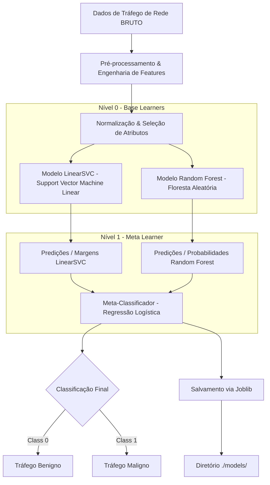
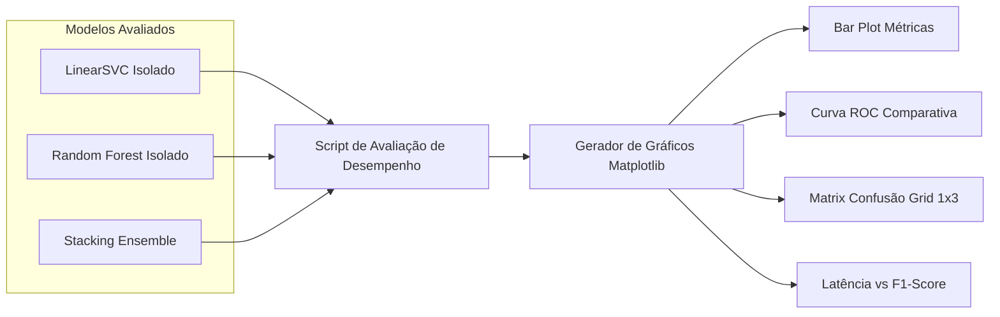

# Arquitetura do Sistema: Detecção de Tráfego Maligno e Benigno (AIDS - Stacking Ensemble)

## 1. Visão Geral

Este projeto consiste em um Sistema de Detecção de Intrusão Baseado em Anomalias e Assinaturas (**AIDS - Anomaly-based Intrusion Detection System**), cujo objetivo principal é classificar pacotes e fluxos de tráfego de rede entre **Maligno** (ataques como DoS/DDoS, Port Scan, Botnet, Brute Force, etc.) e **Benigno** (tráfego legítimo de rede).

Para obter alta precisão, excelente poder de generalização e alta performance em datasets de grande escala, a solução emprega um algoritmo de **Stacking Ensemble (Aprendizado em Camadas)**, combinando as capacidades complementares do **LinearSVC** e do **Random Forest**.

---

## 2. Requisitos de Ambiente de Execução

### 2.1. Ambiente Virtual Obrigatório (Python venv)

É **estritamente obrigatório** o uso de um ambiente virtual Python isolado (`.venv`) para execução de qualquer comando de instalação, treinamento e avaliação no projeto.

- **Criação do Ambiente Virtual:**

  ```bash
  python -m venv .venv
  ```

- **Ativação:**
  - **Windows (PowerShell):** `.\.venv\Scripts\activate`
  - **Linux / macOS:** `source .venv/bin/activate`

---

## 3. Arquitetura da Solução de Machine Learning

### 3.1. O Conceito de Stacking Ensemble

O Stacking combina múltiplos modelos de classificação (Base Learners - Nível 0) através de um meta-classificador (Meta Learner - Nível 1).

- **Nível 0 (Base Learners):**
  - **LinearSVC (Support Vector Machine Linear):** Otimizado com complexidade linear $\mathcal{O}(N)$, ideal para grandes volumes de dados de rede. Encontra o hiperplano de margem máxima de forma extremamente rápida, identificando padrões lineares complexos entre os atributos normalizados.
  - **Random Forest Classifier (Florestas Aleatórias):** Ensemble baseado em múltiplas Árvores de Decisão com amostragem *bootstrap* e seleção aleatória de atributos. Elimina o risco de *overfitting* de uma árvore única, oferecendo alta robustez a ruídos e capturando interações categóricas e condicionais complexas de rede.
- **Nível 1 (Meta-Learner):**
  - **Regressão Logística / Meta-Classificador:** Combina as margens/probabilidades calculadas pelo LinearSVC e pelo Random Forest para tomar a decisão final ponderada sobre a classe do tráfego.



---

## 4. Pipeline de Dados, Treinamento e Persistência

### 4.1. Estágios do Pipeline

1. **Ingestão de Dados de Rede:**
   - Leitura de datasets padrão de cibersegurança (arquivo para treinamento dentro da pasta `data`).
   - Extração de métricas de fluxo (Flow Duration, Total Fwd Packets, Flow Bytes/s, Packet Length Mean, TCP Flags, etc.).

2. **Limpeza e Pré-processamento:**
   - Remoção de valores nulos, infinitos e duplicados.
   - Codificação de atributos categóricos (One-Hot Encoding).
   - Tratamento de *outliers*.

3. **Escalonamento e Engenharia de Features:**
   - Aplicação de `StandardScaler` (fundamental para o bom desempenho do LinearSVC).
   - Seleção de atributos irrelevantes ou redundantes via **Mutual Information** ou **Chi-Square**.

4. **Tratamento de Desbalanceamento:**
   - Ajuste de `class_weight='balanced'` para garantir a detecção de ataques raros com alta sensibilidade.

5. **Validação Cruzada & Out-of-Fold Predictions:**
   - Utilização de **Stratified K-Fold Cross-Validation** (ex: K=5) durante o treinamento do Stacking para gerar as meta-features do Nível 1 sem vazamento de dados (*data leakage*).

6. **Persistência de Modelos Treinados (`joblib` na pasta `./models`):**
   - Após o término do treinamento, o pipeline completo e os artefatos de modelo devem ser serializados e salvos no diretório `./models/` via **`joblib`**:
     - `models/stacking_pipeline.joblib`: Pipeline final unificado (Pré-processador + Stacking Classifier).
     - `models/scaler.joblib`: Objeto de normalização de dados.
     - `models/meta_learner.joblib`: Meta-modelo treinado.

---

## 5. Comparação e Avaliação Visual de Eficácia (Matplotlib & Seaborn)

Para comprovar cientificamente a eficácia do **Stacking Ensemble**, o pipeline de avaliação deve treinar e testar três variações no mesmo conjunto de teste (*Hold-out Test Set*):

1. **Modelo A:** LinearSVC (Isolado)
2. **Modelo B:** Random Forest Classifier (Isolado)
3. **Modelo C:** Stacking Classifier (Ensemble)

### 5.1. Visualizações Obrigatórias via Matplotlib

O script de validação deve gerar e salvar quatro gráficos comparativos em imagem (`.png`) para análise de desempenho:

1. **Gráfico de Barras Agrupadas - Comparativo de Métricas:**
   - Exibe lado a lado: *Acurácia*, *Precisão*, *Recall* e *F1-Score* dos 3 modelos.
   - Permite verificar visualmente o ganho percentual obtido pelo Stacking em relação aos modelos base isolados.

2. **Curva ROC e AUC Comparativa (Receiver Operating Characteristic):**
   - Plot simultâneo das curvas ROC dos três algoritmos no mesmo plano cartesiano Matplotlib (`plt.plot`).
   - Compara a Taxa de Verdadeiros Positivos (TPR) vs. Taxa de Falsos Positivos (FPR) em diferentes limiares de decisão, com o valor numérico de AUC na legenda.

3. **Grid de Matrizes de Confusão (1x3 Subplots):**
   - Utiliza `seaborn.heatmap` em um grid de subplots `plt.subplots(1, 3)` para exibir as matrizes de confusão do LinearSVC, Random Forest e Stacking.
   - Evidencia a redução de **Falsos Negativos** (ataques não detectados) e **Falsos Positivos** (alarmes falsos no tráfego legítimo).

4. **Trade-off de Latência de Inferência vs. F1-Score:**
   - Scatter plot mostrando a latência média de predição (em milissegundos por 1.000 amostras) em relação ao F1-Score final.
   - Demonstra a relação custo-benefício computacional do Stacking frente à sua alta eficácia.



---

## 6. Requisitos Não-Funcionais

- **Ambiente Isolado:** Uso exclusivo do `.venv` para gerenciamento de pacotes.
- **Persistência Estruturada:** Armazenamento garantido dos modelos em formato `.joblib` dentro da pasta `./models/`.
- **Validação Visual de Eficácia:** Geração automática dos relatórios gráficos comparativos em Matplotlib para validação do Stacking.
- **Baixa Latência:** Inferência extremamente rápida (menos de **5 milissegundos** por fluxo) devido ao uso do `LinearSVC` e `Random Forest`.
- **Escalabilidade:** Capacidade de treinar em datasets com milhões de linhas em tempo viável.
- **Reprodutibilidade:** Fixação de sementes randômicas (`random_state=42`) em todo o pipeline.
- **Modularidade:** Pipeline construído com `sklearn.pipeline.Pipeline` e `sklearn.ensemble.StackingClassifier`.
