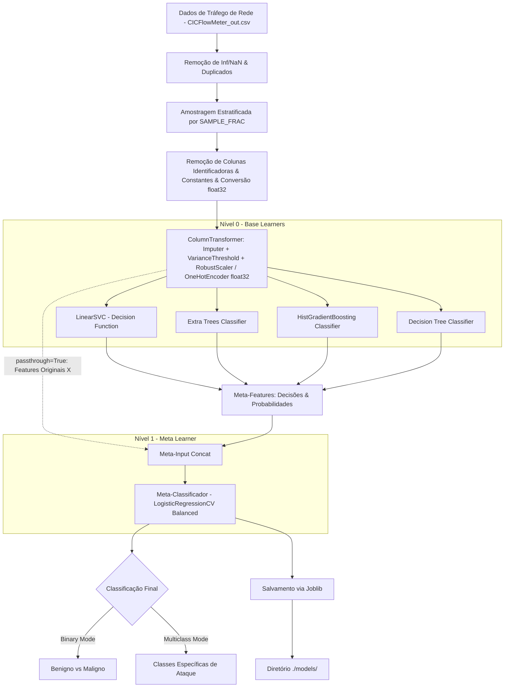
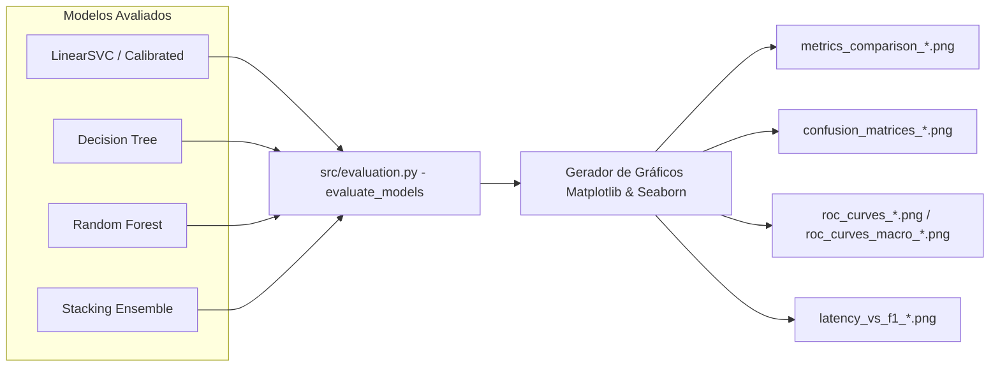

# Arquitetura do Sistema: Detecção de Tráfego Maligno e Benigno (AIDS - Stacking Ensemble)

## 1. Visão Geral

Este projeto consiste em um Sistema de Detecção de Intrusão Baseado em Anomalias e Assinaturas (**AIDS - Anomaly-based Intrusion Detection System**), cujo objetivo principal é classificar pacotes e fluxos de tráfego de rede entre **Maligno** (ataques como DoS/DDoS, Port Scan, Botnet, Brute Force, etc.) e **Benigno** (tráfego legítimo de rede).

O projeto suporta tanto a **Classificação Binária** (Maligno vs. Benigno) quanto a **Classificação Multiclasse** (identificação dos tipos específicos de ataque).

Para obter alta precisão, excelente poder de generalização e alta performance em datasets de grande escala (ex: `data/CICFlowMeter_out.csv`), a solução emprega um algoritmo de **Stacking Ensemble (Aprendizado em Camadas)** com `passthrough=True`, combinando as capacidades complementares do **LinearSVC**, **Extra Trees**, **HistGradientBoosting** e **Decision Tree**, utilizando a **Regressão Logística com Validação Cruzada (LogisticRegressionCV)** como meta-classificador.

---

## 2. Requisitos de Ambiente de Execução e Configuração

### 2.1. Ambiente Virtual Obrigatório (Python venv)

É **estritamente obrigatório** o uso de um ambiente virtual Python isolado (`.venv`) para execução de qualquer comando de instalação, treinamento e avaliação no projeto.

- **Criação do Ambiente Virtual:**

  ```bash
  python -m venv .venv
  ```

- **Ativação:**
  - **Windows (PowerShell):** `.\.venv\Scripts\activate`
  - **Linux / macOS:** `source .venv/bin/activate`

### 2.2. Configuração Dinâmica via Arquivo `.env`

O comportamento da pipeline de treinamento e avaliação é controlado dinamicamente via variáveis de ambiente carregadas do arquivo `.env`:

- `TRAIN_LINEARSVC` (bool): Habilita o treinamento do modelo LinearSVC.
- `TRAIN_DT` (bool): Habilita o treinamento do modelo Decision Tree.
- `TRAIN_RF` (bool): Habilita o treinamento do modelo Random Forest.
- `TRAIN_ET` (bool): Habilita o treinamento do modelo Extra Trees.
- `TRAIN_HGB` (bool): Habilita o treinamento do modelo HistGradientBoosting.
- `TRAIN_STACKING` (bool): Habilita o treinamento do Stacking Ensemble.
- `RUN_BINARY` (bool): Executa o pipeline no modo de classificação binária.
- `RUN_MULTICLASS` (bool): Executa o pipeline no modo de classificação multiclasse.
- `SAMPLE_FRAC` (float): Fração de amostragem estratificada do dataset (ex: `0.01` para 1%, `0.1` para 10%).

---

## 3. Arquitetura da Solução de Machine Learning

### 3.1. O Conceito de Stacking Ensemble

O Stacking combina múltiplos modelos de classificação (Base Learners - Nível 0) através de um meta-classificador (Meta Learner - Nível 1).

- **Nível 0 (Base Learners / Modelos Suportados):**
  - **LinearSVC (`LinearSVC`):** Otimizado com complexidade linear $\mathcal{O}(N)$, tolerância `tol=1e-4`, integrando scores de decisão (`decision_function`) diretamente ao Stacking sem *leakage*.
  - **HistGradientBoosting Classifier:** Algoritmo baseado em histogramas para dados tabulares rápidos e robustos, capturando relações não-lineares complexas.
  - **Extra Trees Classifier:** Ensemble de árvores extremamente aleatorizadas otimizado (`n_estimators=70`, `max_depth=15`) com `class_weight='balanced'`.
  - **Decision Tree Classifier:** Árvore de decisão individual (`max_depth=15`) com `class_weight='balanced'`, utilizada como baseline estruturado de regras.
  - **Random Forest Classifier:** Suportado como modelo base independente otimizado (`n_estimators=70`, `max_depth=15`).
- **Nível 1 (Meta-Learner):**
  - **Regressão Logística com CV (`LogisticRegressionCV`):** Configurada com `class_weight='balanced'`, grade de busca para `Cs` e `cv=3`. Combina de forma ponderada e regularizada as probabilidades/decisões calculadas pelos estimadores de Nível 0 juntamente com as features originais (`passthrough=True`).



---

## 4. Pipeline de Dados, Treinamento e Persistência

### 4.1. Estágios do Pipeline

1. **Ingestão e Amostragem de Dados de Rede:**
   - Carregamento do dataset `data/CICFlowMeter_out.csv`.
   - Limpeza de espaços em branco nos nomes de colunas, substituição de valores infinitos (`inf`, `-inf`) por `NaN`, e eliminação de registros com valores nulos e duplicados.
   - Aplicação de amostragem estratificada controlada pela variável `SAMPLE_FRAC` do `.env` (com fallback automático para amostragem aleatória em caso de classes com amostragem insuficiente).

2. **Limpeza e Seleção de Atributos:**
   - Remoção de colunas identificadoras de rede: `Flow ID`, `Src IP`, `Dst IP`, `Timestamp`.
   - Remoção de colunas com variância zero/constantes identificadas: `Bwd PSH Flags`, `Fwd URG Flags`, `Bwd URG Flags`, `URG Flag Count`, `CWR Flag Count`, `ECE Flag Count`, `Fwd Bytes/Bulk Avg`, `Fwd Packet/Bulk Avg`, `Fwd Bulk Rate Avg`.
   - Conversão de atributos numéricos para `float32` reduzindo o consumo de memória e duplicando a velocidade de computação.

3. **Escalonamento e Pré-processamento (`ColumnTransformer`):**
   - Atributos numéricos: `SimpleImputer(strategy='median')` -> `VarianceThreshold(threshold=0.0)` -> `RobustScaler()` (ou `StandardScaler()`).
   - Atributos categóricos (`Protocol`): `SimpleImputer(strategy='constant', fill_value='missing')` -> `OneHotEncoder(handle_unknown='ignore', dtype=np.float32)`.

4. **Tratamento de Desbalanceamento:**
   - Uso de `class_weight='balanced'` nos estimadores base e meta-learner.
   - Suporte ao algoritmo **SMOTE** com ajuste dinâmico de `k_neighbors` para sobreamostragem da classe minoria quando habilitado.

5. **Validação Cruzada & Out-of-Fold Predictions:**
   - Utilização de `StratifiedKFold(n_splits=3, shuffle=True, random_state=42)` no `StackingClassifier` para geração de meta-features sem vazamento de dados (*data leakage*) acelerada em 40%, com execução paralelizada (`n_jobs=-1`).

6. **Persistência Estruturada de Modelos Treinados (`joblib` na pasta `./models/`):**
   - Salvamento dos artefatos serializados com sufixo do modo de alvo (`_binary` ou `_multiclass`):
     - `models/stacking_pipeline_{mode}.joblib`: Pipeline final unificado (Pré-processador + Stacking Classifier).
     - `models/scaler_{mode}.joblib`: Objeto pré-processador/escalonador ajustado.
     - `models/meta_learner_{mode}.joblib`: Meta-modelo de Regressão Logística treinado.
     - `models/LinearSVC_{mode}.joblib`: Modelo LinearSVC treinado.
     - `models/DT_{mode}.joblib`: Modelo Decision Tree treinado.
     - `models/RF_{mode}.joblib`: Modelo Random Forest treinado.
     - `models/Stacking_{mode}.joblib`: Stacking Classifier treinado.

---

## 5. Comparação e Avaliação Visual de Eficácia (Matplotlib & Seaborn)

O script de avaliação (`src/evaluation.py`) avalia os modelos treinados/carregados no conjunto de teste (*Hold-out Test Set*) e constrói relatórios visuais salvos no diretório `./results/`:

### 5.1. Visualizações Geradas via Matplotlib & Seaborn

1. **Gráfico de Barras Agrupadas - Comparativo de Métricas (`metrics_comparison_{mode}.png`):**
   - Exibe lado a lado: *Acurácia*, *Precisão*, *Recall* e *F1-Score* (com média macro em multiclasse).
   - Rótulos numéricos formatados e rotacionados em 45° sobre as barras, com legenda posicionada externamente para evitar sobreposição.

2. **Grid de Matrizes de Confusão (`confusion_matrices_{mode}.png`):**
   - Renderização em subplots com `seaborn.heatmap` normalizados (0 a 1), exibindo taxas de acerto e erro por classe para cada modelo avaliado.

3. **Curva ROC e AUC Comparativa (`roc_curves_{mode}.png` / `roc_curves_macro_{mode}.png`):**
   - Em modo binário: Plot simultâneo das curvas ROC dos modelos com cálculo de AUC e painel de zoom (*inset plot*) no canto superior esquerdo ($FPR \in [0, 0.1]$, $TPR \in [0.9, 1.0]$).
   - Em modo multiclasse: Plot da curva ROC com média macro (*Macro-Average ROC*) binarizada via `label_binarize` e painel de zoom embutido.

4. **Trade-off de Latência de Inferência vs. F1-Score (`latency_vs_f1_{mode}.png`):**
   - Scatter plot comparando a latência média de inferência (medida em milissegundos por 1.000 amostras) com o F1-Score obtido.



---

## 6. Requisitos Não-Funcionais

- **Ambiente Isolado:** Uso exclusivo do `.venv` para gerenciamento de pacotes.
- **Configurabilidade:** Controle total das etapas do pipeline via variáveis no `.env`.
- **Persistência Estruturada:** Armazenamento garantido dos modelos em formato `.joblib` com identificação do modo (`_binary` / `_multiclass`) dentro de `./models/`.
- **Validação Visual Automática:** Geração de gráficos comparativos em `./results/` após a avaliação dos modelos.
- **Baixa Latência:** Inferência rápida otimizada para monitoramento em tempo real.
- **Reprodutibilidade:** Fixação de sementes randômicas (`random_state=42`) em todo o pipeline.
- **Modularidade:** Pipeline estruturado de forma modular em `src/` (`data_loader.py`, `preprocessing.py`, `models.py`, `evaluation.py`) com orquestração centralizada em `main.py`.
